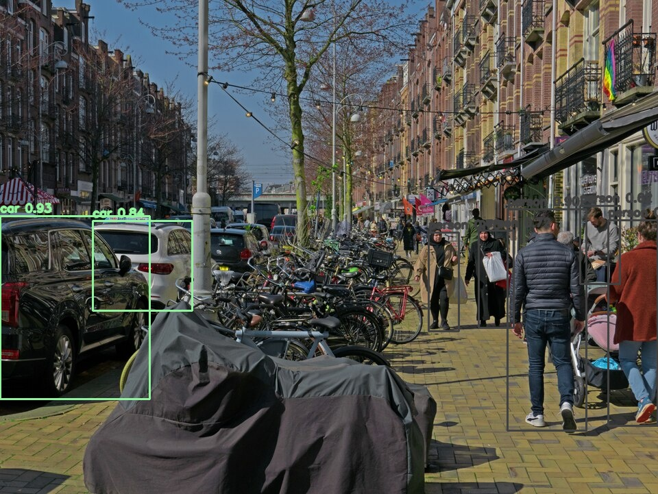
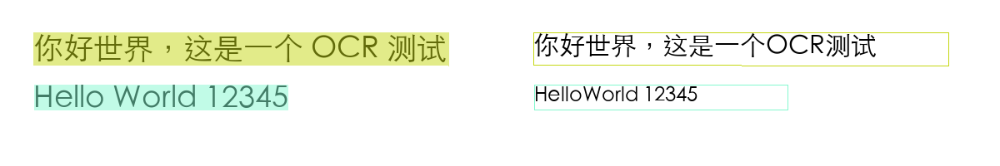

# ModelCLI

[](https://github.com/GraySilver/modelcli/graphs/commit-activity)
[](https://github.com/GraySilver/modelcli/blob/main/src/modelcli/__init__.py)
[](https://github.com/GraySilver/modelcli/blob/main/pyproject.toml)
[](#agent-json-%E5%8D%8F%E8%AE%AE)
[](https://github.com/GraySilver/modelcli/blob/main/LICENSE)

**简体中文** | [English](./README_EN.md)

[Agent Skill](#agent-skill) | [快速开始](#快速开始) | [效果预览](#效果预览) | [命令示例](#命令示例) | [Agent JSON 协议](#agent-json-协议) | [开发](#开发)

> 在本地统一运行目标检测、OCR、语音识别和语音合成，为人类和 Agent 提供同一套命令行入口。

## Agent Skill

把下面这句话直接发给 Codex、Claude Code 或 OpenClaw：

```text
帮我安装 ModelCLI Agent Skill（https://github.com/GraySilver/modelcli）：请读取仓库里的 install-skill.sh，根据你当前是 Codex、Claude Code 还是 OpenClaw 选择对应的 --target 安装，验证 SKILL.md 已出现在正确的用户级 Skills 目录，并告诉我是否需要重启。
```

仓库内置一个统一的 [`modelcli` Agent Skill](./skills/modelcli/SKILL.md)，覆盖目标检测、OCR、语音识别、语音合成、模型管理和诊断，可用于 Codex、Claude Code 与 OpenClaw。三者在本仓库中都能自动发现该 Skill：Codex 和 OpenClaw 通过 [`.agents/skills/modelcli`](./.agents/skills/modelcli)，Claude Code 通过 [`.claude/skills/modelcli`](./.claude/skills/modelcli)。

打开仓库后，可以直接向 Agent 发出请求：

```text
# Codex
$modelcli 识别 samples/images/ocr-sign.png 中的文字

# Claude Code / OpenClaw
/modelcli 检测 samples/images/detect-street.jpg 里的行人和汽车
```

也可以手动将 Skill 安装到个人目录，让其他项目同样可用。安装脚本支持 macOS 和 Linux，默认同时安装全部目标：

```bash
curl -LsSf https://raw.githubusercontent.com/GraySilver/modelcli/main/install-skill.sh | sh
```

按 Agent 单独安装或从本地仓库安装：

```bash
curl -LsSf https://raw.githubusercontent.com/GraySilver/modelcli/main/install-skill.sh \
  | sh -s -- --target claude

./install-skill.sh --target codex
./install-skill.sh --target openclaw
./install-skill.sh --target all
```

Codex 与 OpenClaw 共用 `~/.agents/skills/modelcli`，Claude Code 使用 `~/.claude/skills/modelcli`。安装后重启对应 Agent。卸载由此脚本安装的 Skill：

```bash
./install-skill.sh --target all --uninstall
```

Skill 通过确定性的 JSON 包装器调用 ModelCLI。如果找不到 `modelcli`，它会运行官方 `install.sh`；普通推理缺少模型时也允许自动下载。覆盖输出、刷新或删除模型缓存以及 `doctor --deep` 等敏感操作，仍会先要求用户明确确认。

ModelCLI 将多个开源小模型封装为一致的 CLI。默认模式适合直接在终端中使用；加上全局 `--json` 后，会输出稳定、可解析的 JSON 信封，方便 JarvisBot、自动化脚本和其他 Agent 通过子进程调用。

模型下载一次后即可离线推理。默认缓存位于 `~/Library/Caches/modelcli`；Linux 等其他平台遵循 [`platformdirs`](https://platformdirs.readthedocs.io/) 的用户缓存目录约定。

| 能力 | 默认模型 | 输入 | 输出 |
| --- | --- | --- | --- |
| 目标检测 | PicoDet-L 416 COCO | 图片 | 80 类物体、置信度、像素坐标、标注图 |
| OCR | PP-OCRv4 mobile | 图片 | 中英文文本、文本行、坐标、置信度、标注图 |
| ASR | SenseVoiceSmall INT8 ONNX | WAV / FLAC / MP3 | 中、英、粤、日、韩文本，时间段、情绪和事件 |
| TTS | MOSS-TTS-Nano | 文本 + 可选参考音频 | 48 kHz 立体声克隆语音 |

## 快速开始

一行安装，适用于 macOS 和 Linux：

```bash
curl -LsSf https://raw.githubusercontent.com/GraySilver/modelcli/main/install.sh | sh
```

安装脚本会在需要时安装 `uv`，使用 Python 3.12 和仓库中的 `uv.lock` 创建隔离环境，并将 `modelcli` 放入 `~/.local/bin`。安装代码和 Python 依赖时不会下载推理模型。

```bash
modelcli --version
modelcli doctor
modelcli models list
```

如果终端提示找不到 `modelcli`，将用户命令目录加入 `PATH`：

```bash
export PATH="$HOME/.local/bin:$PATH"
```

也可以先检查脚本再执行：

```bash
curl -LsSf https://raw.githubusercontent.com/GraySilver/modelcli/main/install.sh -o install.sh
less install.sh
sh install.sh
```

使用 Python 3.11 安装：

```bash
MODELCLI_PYTHON=3.11 sh install.sh
```

首次推理缺少模型时，人类模式会自动下载对应模型。希望提前准备全部模型，可运行：

```bash
modelcli models prefetch
modelcli models verify all
```

目标检测、ASR 和 TTS 模型合计约 590 MB；OCR 与 VAD 随 Python 依赖提供。

## 效果预览

以下结果由当前版本的 ModelCLI 实际生成，原始输入、完整输出、复现命令和素材许可见 [`samples/`](./samples/README.md)。

### 目标检测

| 输入 | ModelCLI 输出 |
| :---: | :---: |
|  |  |

PicoDet-L 416 COCO 在阈值 `0.6` 下检测出 5 位行人和 2 辆汽车。

```bash
modelcli detect samples/images/detect-street.jpg \
  --confidence 0.6 \
  --draw-boxes detected.jpg
```

### OCR



```text
你好世界，这是一个OCR测试
HelloWorld 12345
```

### ASR 与 TTS

- [试听 ASR 输入音频](./samples/audio/asr-zh.wav) -> [查看 SenseVoiceSmall 实际转写](./samples/results/asr-zh.txt)
- [试听 MOSS-TTS-Nano 合成音频](./samples/audio/tts-zh.wav)

```text
[0.10-0.54] 你好
[1.19-2.43] 欢迎使用本地模型
[3.14-5.60] 这是一段清晰的中文语音识别测试
```

## 核心特性

### 一套命令处理本地多模态任务

```bash
modelcli detect photo.jpg --class person --draw-boxes detected.jpg
modelcli ocr screenshot.png --markdown
modelcli asr meeting.wav --lang zh --timestamps
modelcli tts "你好，世界。" --out hello.wav
```

每种能力共享一致的模型管理、错误码、进度输出和文件安全策略。下载完成后，图片、音频和文本都留在本机处理。

### 面向 Agent 的稳定接口

```bash
modelcli --json detect photo.jpg --class person
modelcli --json ocr screenshot.png
modelcli --json asr meeting.wav --lang zh
modelcli --json tts "你好，世界。" --out /absolute/path/hello.wav
```

Agent 模式下 stdout 只包含一个 JSON 文档，进度和诊断信息只写入 stderr。成功与失败都使用同一套信封结构，调用方无需解析终端文案。

### 可验证的模型缓存

ModelCLI 为目标检测、ASR 和 TTS 模型生成本地 manifest，记录模型来源、请求版本、文件大小和 SHA-256。`models verify` 可以发现缺失、损坏或被修改的文件；`models install --refresh` 会在临时缓存中完成下载和验证，再替换现有模型。

### 安全的输出发布

TTS 音频以及目标检测/OCR 标注图默认拒绝覆盖已有文件。传入 `--force` 时，结果先写入同目录临时文件，验证成功后再原子替换目标；失败或中断不会破坏原文件。

## 命令示例

### 目标检测

```bash
# 默认保留置信度不低于 0.5 的全部 COCO 类别
modelcli detect photo.jpg

# --class 可重复，类别名使用英文 COCO 名称
modelcli detect street.jpg --confidence 0.6 --class person --class car

# 保存带检测框的图片；覆盖已有文件时需要 --force
modelcli detect street.jpg --draw-boxes detected.jpg --force
```

目标检测固定使用 PicoDet-L 416 COCO 和 `CPUExecutionProvider`。它只识别 COCO 的 80 个固定类别，不是开放词汇视觉模型，也不用于识别按钮、输入框等 UI 元素。

### OCR

```bash
modelcli ocr document.png
modelcli ocr document.png --markdown
modelcli ocr document.png --out result.txt
modelcli ocr document.png --draw-boxes annotated.png
```

### 语音识别

```bash
modelcli asr recording.wav
modelcli asr recording.wav --lang zh --timestamps
modelcli asr recording.wav --lang en --emotion
modelcli asr recording.wav --no-vad --out transcript.txt
```

`--lang` 支持 `auto`、`zh`、`en`、`yue`、`ja` 和 `ko`。默认启用 Silero VAD，将长音频切分为有效语音段。

### 语音合成

```bash
# 未指定 --out 时，人类模式默认写入 ./output.wav
modelcli tts "你好，世界。"
modelcli tts "你好，世界。" --out hello.wav
modelcli tts @input.txt --out audiobook.wav
modelcli tts "这是一段克隆语音。" --prompt-audio my_voice.wav --out cloned.wav
```

未传 `--prompt-audio` 时使用随 TTS 模型安装的默认中文女声。`--max-duration` 控制生成 frame 上限，不是进程的墙钟超时。

## Agent JSON 协议

`--json` 是全局选项，必须放在子命令之前：

```bash
modelcli --json capabilities
modelcli --json doctor
modelcli --json models list
modelcli --json detect photo.jpg --class person
```

固定行为：

- stdout 始终只有一个以换行结尾的 JSON 文档；stderr 只用于进度、依赖日志和 `--debug` traceback。
- 缺少模型时返回 `MODEL_NOT_INSTALLED`，不会隐式下载。
- 需要在推理期间下载时，显式加入全局 `--allow-download`。
- `models install` 和 `models install --refresh` 本身就是显式下载动作，不需要 `--allow-download`。
- TTS 必须显式传入 `--out`，结果中的输出路径为绝对路径。
- 调用方负责墙钟超时以及 SIGTERM/SIGKILL；退出码 `124` 为调用方超时保留。

成功信封示例：

```json
{
  "schema_version": "1",
  "ok": true,
  "operation": "asr",
  "result": {
    "text": "hello",
    "language": "en",
    "segments": []
  },
  "meta": {
    "modelcli_version": "0.3.0",
    "elapsed_ms": 123
  }
}
```

失败信封示例：

```json
{
  "schema_version": "1",
  "ok": false,
  "operation": "ocr",
  "error": {
    "code": "INVALID_IMAGE",
    "message": "Input is not a readable image",
    "retryable": false
  },
  "meta": {
    "modelcli_version": "0.3.0",
    "elapsed_ms": 4
  }
}
```

退出码：

| 退出码 | 含义 |
| ---: | --- |
| `0` | 成功 |
| `2` | CLI 参数或用法错误 |
| `3` | 输入无效 |
| `4` | 模型缺失、安装、下载或校验失败 |
| `5` | 推理或内部错误 |
| `6` | 输出冲突或写入失败 |
| `124` | 调用方超时保留，ModelCLI 自身不返回 |
| `130` | SIGINT / Ctrl-C |

调用方应分别捕获 stdout、stderr 和返回码。即使返回码非零，也应从 stdout 解析同一个错误信封；stderr 不能作为业务结果解析。

## 模型管理

```bash
modelcli models list
modelcli models install detect
modelcli models install asr
modelcli models install tts
modelcli models install all
modelcli models verify all
modelcli models install detect --refresh
modelcli models remove detect
modelcli models prefetch
modelcli models clean
```

`prefetch` 等价于 `install all`，`clean` 等价于 `remove all`。`all` 按 `detect -> asr -> tts` 的顺序处理三个可下载能力。

| 能力 | 模型与版本 | 约大小 | 许可 |
| --- | --- | ---: | --- |
| 目标检测 | PicoDet-L 416 COCO，PaddleDetection `release/2.8` | 23.2 MB | Apache 2.0 |
| OCR | PP-OCRv4 mobile | 15 MB | Apache 2.0 |
| ASR | `iic/SenseVoiceSmall-onnx@v2.0.5` INT8 | 242 MB | MIT |
| VAD | Silero VAD | 10 MB 内 | MIT |
| TTS | MOSS-TTS-Nano + Audio Tokenizer + prompt | 326 MB | Apache 2.0 |

安装、刷新、删除、校验、推理和 `doctor --deep` 按能力使用跨进程锁。普通安装不会静默更新已经校验的模型；`--refresh` 成功前会保留旧模型。

## 诊断

```bash
modelcli capabilities
modelcli doctor
modelcli doctor --deep
```

`capabilities` 报告 CLI/schema 版本、命令和选项、运行设备、ONNX provider、缓存目录及模型状态。`doctor` 默认进行依赖、目录可写性、模型文件、manifest 和 hash 检查；`--deep` 还会实际加载已安装模型。两种诊断都不会下载缺失模型。

## 更新与卸载

重新执行安装脚本即可从 `main` 更新，模型缓存不会重复下载：

```bash
curl -LsSf https://raw.githubusercontent.com/GraySilver/modelcli/main/install.sh | sh
```

卸载代码和 Python 环境：

```bash
curl -LsSf https://raw.githubusercontent.com/GraySilver/modelcli/main/install.sh | sh -s -- --uninstall
```

卸载脚本不会删除模型缓存。如需一并清理，先运行 `modelcli models clean`。

## 从源码运行

需要 Python 3.11 或 3.12，以及 [`uv`](https://docs.astral.sh/uv/)：

```bash
git clone https://github.com/GraySilver/modelcli.git
cd modelcli
uv sync --frozen
uv run modelcli --help
```

## 开发

```bash
git clone https://github.com/GraySilver/modelcli.git
cd modelcli

uv sync --frozen
uv lock --check
uv run pytest -q
uv run python -m compileall -q src
uv build
```

模型、manifest、音频、缓存、虚拟环境、构建产物和临时文件不应提交到仓库。

## License

ModelCLI 使用 [Apache License 2.0](./LICENSE)。各模型及运行库仍遵循各自的许可证；分发或商用前请同时核对对应上游项目的条款。
